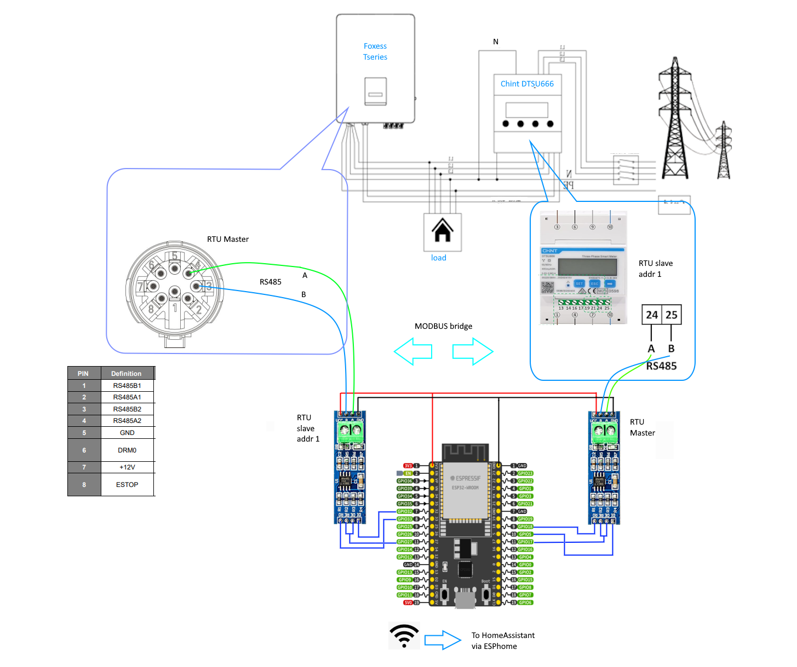

# foxess_chint_modbus_bridge
ESP32 modbus bridge between Foxess T series inverter and Chint DTSU666 Energy meter to sniff some data for Home Assistant

### Objectives

Get real-time data from Chint DTSU666 energy meter to HomeAssistant. As there is only one port for communication in this meter, and it is occupied by Foxess inverter, it is necessary to put a bridge in between these two, and extract interesting data to push them via Wifi to HomeAssistant.

There are great projects that take data from Foxess inverter secondary RS485 port and present them to HomeAssistant. Check [/Foxess-T-series-ESPHome-Home-Assistant](https://github.com/assembly12/Foxess-T-series-ESPHome-Home-Assistant) (and I have it running too), but for me it was interesting to see data from whole installation point of view, especially power and current on each phase, voltage on each phase (to see when photovoltaics comes close to upper voltage limit in my country = 253V, to send signal to home heavy load to consume more energy. Otherwise inverter will shut down)
Somewhere i read that it would be good to sniff data that inverter is talking to meter, but I tried and realized that inverter only asks for a few registers. in case of my Foxess T10 G3 it is reading only:

Foxess mater RTU **0103201200026FCE**  
Chint meter slave RTU >> **01030445000000EF3F**  
register meaning = 2012H = Pt Combined active power, Unit W(×0.1W)

Foxess mater RTU >> **01031028000240C3**  
Chint meter slave RTU >> **010304440D370AE937**  
register meaning = 1028H = ExpEp （current）negative total active energy(kWh) 

Foxess mater RTU >> **010300060001640B**  
Chint meter slave RTU >> **01030200017984**  
register meaning = 0006H = Current transformer rate IrAt

Foxess mater RTU >> **01030007000135CB**  
Chint meter slave RTU >> **010302000A3843**  
register meaning = 0007H = Voltage transformer rate

All data are signed float32 , BIG Endian, addresses from "0"

